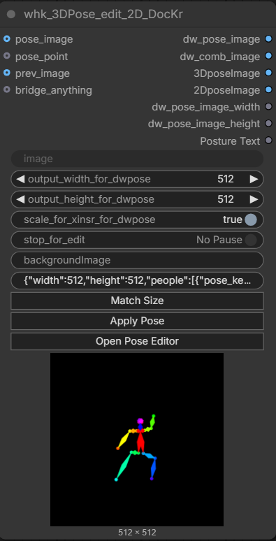
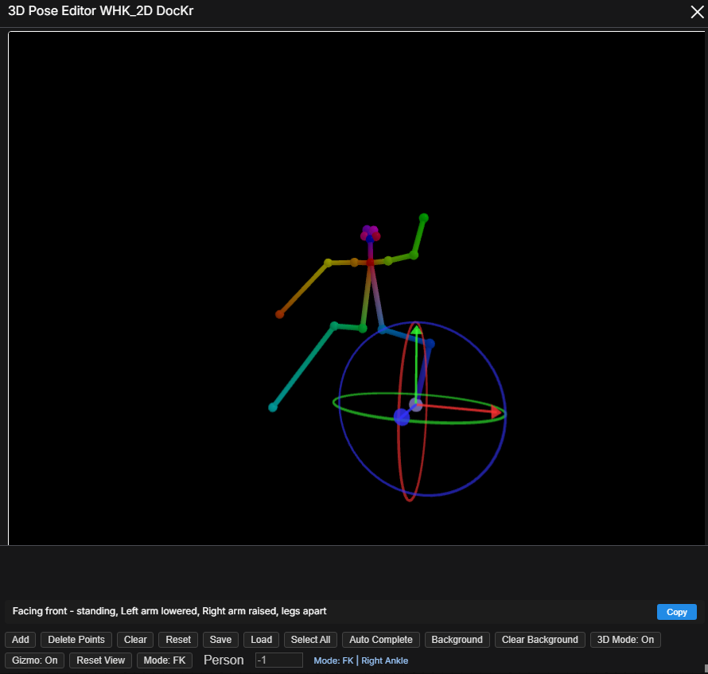

# ComfyUI-3D-OpenPose-Editor2026

[English README](./README.md)

這是一個為 ComfyUI 打造的 2D / 3D OpenPose 編輯節點，適合直接放進工作流中進行姿勢調整。

這個版本保留原本的 2D 編輯流程，並加入完整的 3D 編輯能力，以及一系列實用優化，例如視角回正、FK / IK 編輯模式、JSON 自訂命名保存、背景圖對照、以及與其他 OpenPose 編輯器並存時的前端衝突修正。

目前這個客製版本的實際 UI 已經英文化，包含工具列按鈕、面板標題、提示視窗與執行狀態文字。

## 截圖

### 節點畫面



### 3D 編輯器



## 功能特色

- 單一節點同時支援 2D 與 3D 姿勢編輯
- `回正` 按鈕可恢復到初始相機角度與縮放
- FK 式關節編輯，適合沿骨架鏈做精準調整
- 四肢 IK 支援，在不改變肢體長度下拖動末端關節
- 內建 3D gizmo，可沿 X / Y / Z 軸移動與旋轉
- 保存 pose JSON 時可先輸入檔名
- 載入 JSON 時可恢復 3D 姿勢、相機狀態與模型旋轉
- 支援背景圖載入，方便描姿勢
- 支援自動補全缺失的四肢點位與連線
- 可輸出姿勢文字描述給後續節點使用
- 改善與其他 OpenPose 編輯器同時使用時的前端相容性

## 安裝方式

將此專案放入 ComfyUI 的 `custom_nodes` 目錄：

```bash
cd ComfyUI/custom_nodes
git clone <你的-repo-url> ComfyUI-3D-OpenPose-Editor2026
```

之後重新啟動 ComfyUI。

如果你是從舊版本更新，重啟後建議再對瀏覽器做一次強制重新整理。

## 快速開始

1. 在工作流中加入 `Nui.OpenPoseEditor` 節點。
2. 打開節點編輯面板。
3. 先在 2D 模式調姿，或直接切到 3D 模式。
4. 需要時可使用 `Open Pose Editor`、`Match Size`、`Apply Pose` 等節點按鈕。
5. 可載入或保存 pose JSON。
6. 將節點輸出接到你的姿勢驅動工作流中。

## 工具列說明

| 按鈕 | 功能 |
| --- | --- |
| `Add` | 新增一組姿勢 |
| `Delete Points` | 刪除目前選取的關節 |
| `Clear` | 清空目前姿勢 |
| `Reset` | 回到最初載入的姿勢 |
| `Save` | 匯出 JSON，並可自訂檔名(compatible with andreszs/ComfyUI-OpenPose-Studio's json format) |
| `Load` | 載入已保存的 pose JSON(compatible with andreszs/ComfyUI-OpenPose-Studio's json format) |
| `Select All` | 全選所有關節 |
| `Auto Complete` | 自動補齊缺失關節與肢體連線 |
| `Background` | 載入背景圖片 |
| `Clear Background` | 刪除背景圖片 |
| `3D Mode: On / Off` | 切換 2D / 3D 編輯模式 |
| `Gizmo: On / Off` | 開啟或關閉 3D gizmo |
| `Reset View` | 將 3D 視角恢復到初始狀態 |
| `Mode: FK / IK` | 切換 FK / IK 編輯模式 |

## 3D 操作方式

| 操作 | 說明 |
| --- | --- |
| 左鍵點擊 | 選取關節或 gizmo |
| 左鍵拖曳 | 移動關節或自由拖曳 |
| 右鍵拖曳 | 旋轉相機視角 |
| 中鍵拖曳 | 平移相機 |
| 滾輪 | 放大或縮小 |

## 快捷鍵

| 快捷鍵 | 功能 |
| --- | --- |
| `Ctrl + A` | 全選 |
| `Delete` / `Backspace` | 在 3D 模式刪除選取關節 |
| `Esc` | 清除選取 |
| `R` | 回正視角 |
| `F` | 切換到 FK 模式 |
| `I` | 切換到 IK 模式 |
| `Ctrl + Z` | 復原 |
| `Ctrl + Y` | 重做 |

## 節點按鈕

ComfyUI 圖面上的節點 widget 目前也已改成英文：

- `Open Pose Editor`
- `Match Size`
- `Apply Pose`

## FK 與 IK 使用建議

### FK

FK 模式適合你從父關節去帶動整條骨架鏈，例如調整手臂朝向、腿部角度、或整體動作弧線。當你旋轉某個關節時，後續的子關節會跟著一起變化。

### IK

IK 模式適合直接拖動末端點，例如手腕或腳踝，同時盡量維持肢體長度不變。這一版目前主要支援兩節骨鏈：

- 左手臂
- 右手臂
- 左腿
- 右腿

## 保存格式

匯出的 JSON 會包含：

- 2D 投影姿勢資料
- 3D 點位資料
- 3D 骨架連線資料
- 相機狀態
- 模型旋轉
- orbit center

因此你可以在之後重新載入同一份 JSON，接續編輯相同的 3D 狀態。

## 補充說明

- 這個專案基於 DocKr OpenPose Editor 延伸開發，並加入更多 3D 編輯與工作流整合能力。
- 如果你同時使用其他 OpenPose 編輯器插件，更新後建議清除前端快取或強制重新整理頁面。
- 目前的 IK 目標是提升日常四肢調姿效率，還不是完整角色骨架系統。

## 致謝

- 原始 2D editor 基礎：DocKr OpenPose Editor
- 本版本針對 ComfyUI 中的混合 2D / 3D 姿勢編輯流程進行客製與擴充

## 授權

這一節請依照你打算發布到 GitHub 的授權方式自行補上或調整。
